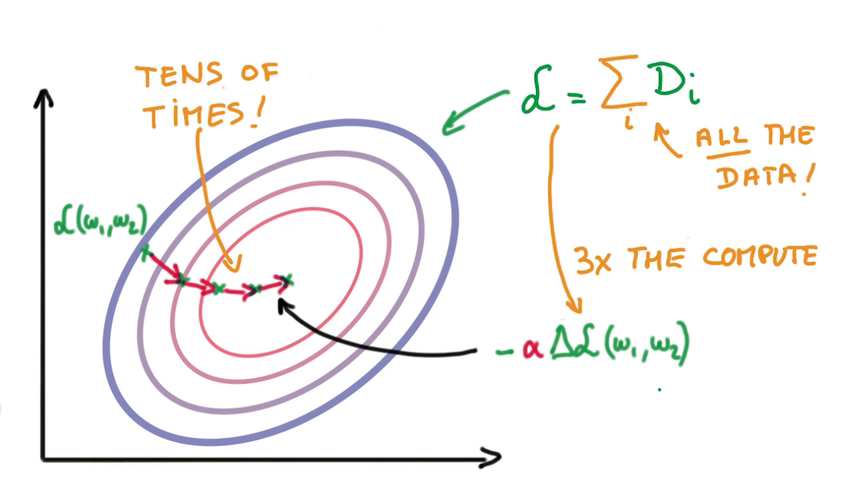
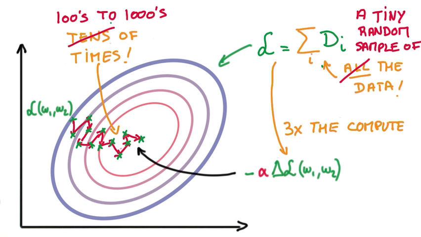
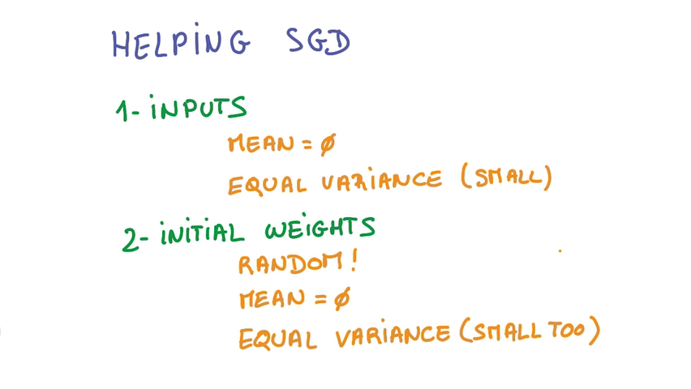
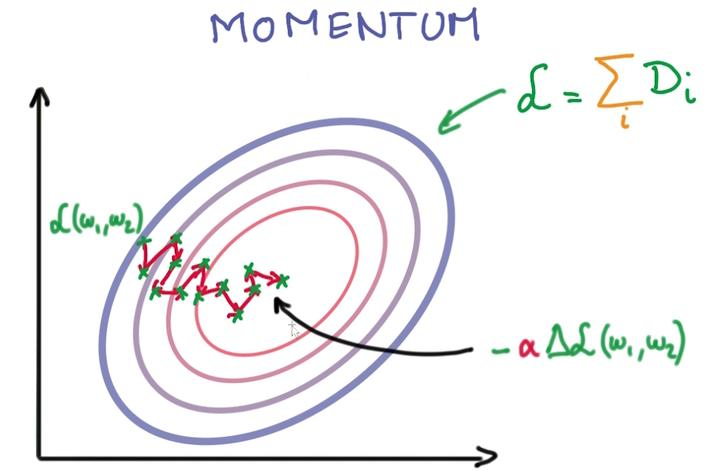
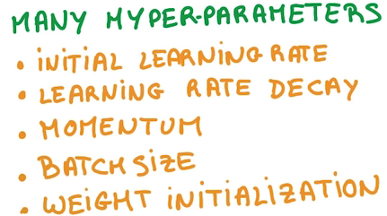

# Stochastic Optimization

> Github工程地址：https://github.com/ahangchen/GDLnotes

> 欢迎star，有问题可以到[Issue区](https://github.com/ahangchen/GDLnotes/issues)讨论

> 官方教程[地址](https://classroom.udacity.com/courses/ud730/lessons/6370362152/concepts/63798118170923)

> [视频](http://d2uz2655q5g6b2.cloudfront.net/6370362152/L1%20Machine%20Learning%20to%20Deep%20Learning%20Videos.zip)/[字幕](http://d2uz2655q5g6b2.cloudfront.net/6370362152/L1%20Machine%20Learning%20to%20Deep%20Learning%20Subtitles.zip)下载
    

- 实践中大量机器学习都是通过梯度算子来求优化的
- 但有一些问题，最大的问题就是，梯度很难计算
- 我们要计算train loss，这需要基于整个数据集的数据做一个计算
- 而计算使 train loss 下降最快的调整方向需要的时间是计算train loss本身的三倍

- 因此有了SGD：Stochastic Gradient Descent
  - 计算train loss时，只随机取一小部分数据集做为输入
  - 调整W和b时，调整的大小step需要比较小，因为数据集小，我们找到的不一定是对的方向
  - 这样也就增加了调整的次数
  - 但可观地减小了计算量

## SGD的优化

> 实际上SGD会使得每次寻找的方向都不是很准，因此有了这些优化

- 随机的初始值

- Momentum

> 考虑以前的平均调整方向来决定每一步的调整方向

- Learning Rate Decay
  - 训练越靠近目标，步长应该越小
  
- Parameter Hyperspace
  - Learning Rate（即调整的step）不是越大越好，可能有瓶颈
  - SGD有许多参数可以调整，所以被称为黑魔法
  
  
  - AdaGurad
    - 自动执行momentum和learning rate decay
    - 使得SGD对参数不像原来那样敏感
    - 自动调整效果不如原来的好，但仍然是一个option
 
 扩展阅读：[SGD](http://cweihang.cn/ml/base/SGD.pdf)
 
 
> 觉得得我的文章对您有帮助的话，就给个[star](https://github.com/ahangchen/GDLnotes)吧～
  - SGD有许多参数可以调整，所以被称为黑魔法阅读
  - SGD有许多参数可以调整，所以被称为黑魔法
