# Logistic Classification

> Github工程地址：https://github.com/ahangchen/GDLnotes

> 欢迎star，有问题可以到[Issue区](https://github.com/ahangchen/GDLnotes/issues)讨论

> 官方教程[地址](https://classroom.udacity.com/courses/ud730/lessons/6370362152/concepts/63798118170923)

> [视频](http://d2uz2655q5g6b2.cloudfront.net/6370362152/L1%20Machine%20Learning%20to%20Deep%20Learning%20Videos.zip)/[字幕](http://d2uz2655q5g6b2.cloudfront.net/6370362152/L1%20Machine%20Learning%20to%20Deep%20Learning%20Subtitles.zip)下载
    
## About

> simple but important classifier

- 训练你的第一个端到端模型
- 下载并预处理图片
- 在图像数据上运行Logistic classifier进行分类
- 相关的数学背景知识和代码

## Detail
### Linear Classifier

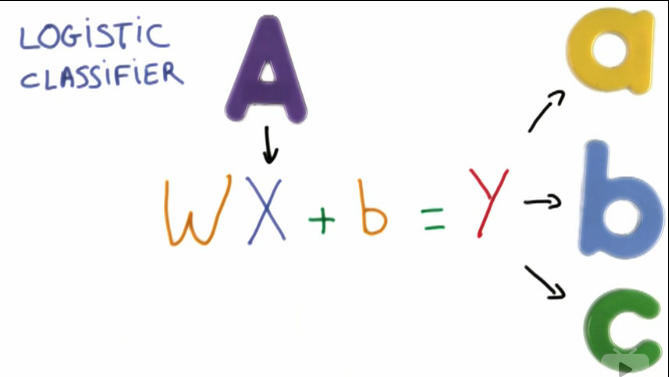

> 之所以这样建模，是因为线性公式是最简单的数学模型，仅此而已。

- Input: X (e.g. 图像中像素的灰度值)
- 将一个线性函数作用在X上
  - 大矩阵相乘 
  - 输入一个代表图片的向量
  - 将输入向量和一个矩阵W相乘，W表示权重
  - b代表偏移（biased）项
  - 机器学习便是调整权重和偏移值以达到最好的预测效果
- 输出: Y, 对输入应当属于哪个类进行预测
  - Y是一个代表每个label可能性的向量
  - 好的预测中，正确的label的概率应当更接近1
  - 往往得到的Y一开始不是概率，而是一些具体值（scores/logits），所以需要转换，by：
  
  > Softmax回归模型：[Wikipedia](http://ufldl.stanford.edu/wiki/index.php/Softmax%E5%9B%9E%E5%BD%92) 
  
  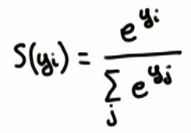
### Softmax  
  - 代码 [soft_max.py](../../src/soft_max.py)：Softmax实现与应用
  - input的score差异越大（可以全部乘10试试），则输出的各项label概率差异越大，反之差异越小
  - Softmax只关心几个label之间的概率，不关心具体值
  - 机器学习是一个让预测成功率升高的事情，因此是一个让score之间差异增大的过程
  
### One hot encoding
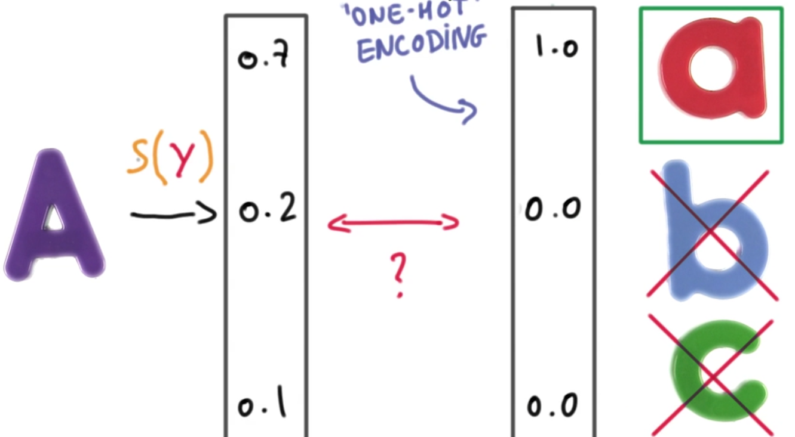

> 正确预测结果应当是只有一个label成立，其他label不成立。这种情况下，预测概率最大的则是最可能的结果。

> Example: take this [test](https://classroom.udacity.com/courses/ud730/lessons/6370362152/concepts/63713510510923) 

  - one hot encoding在label很多的情况下效果不好，因为output vector到处都是0，很稀疏，因此效率低
    - solved by [embeddings](../lesson-4/README.md)
  - 好处：可以measure我们与理想情况之间的距离（compare two vectors）
  
  > 分类器输出：[0.7 0.2 0.1] \<=\> 与label对应的真实情况：[1 0 0]
  
  - Compare two vectors: cross-entropy
  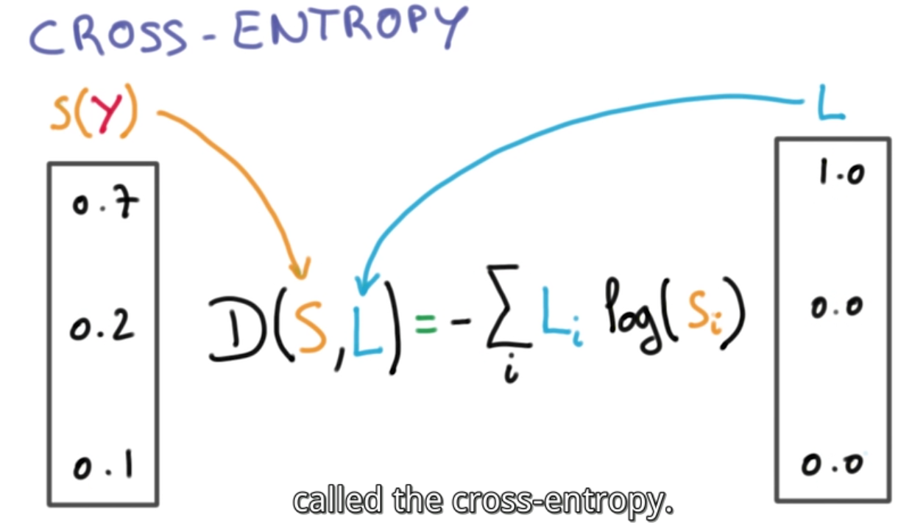
  
  - D(S, L) != D(L, S)
    
  > Remember: Label don't log, for label zero 
 
### 小结
 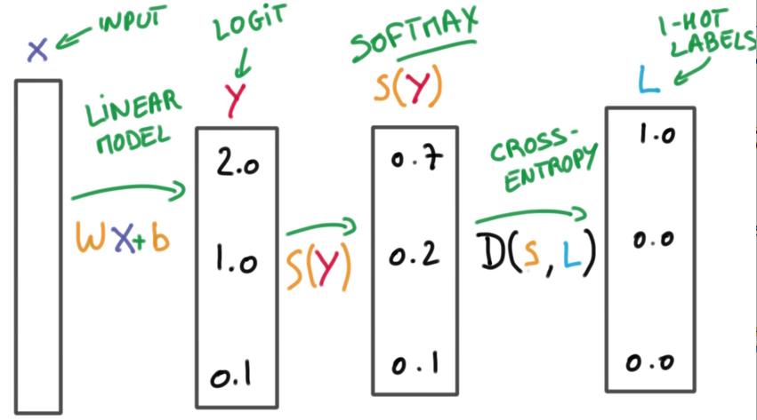
 
 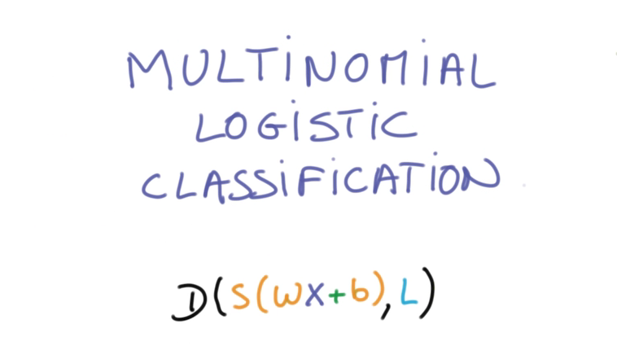
 
 找到合适的W和b，使得S和L的距离D的平均值，在整个数据集n中最小。
 
### 最小化cross-entropy
 
 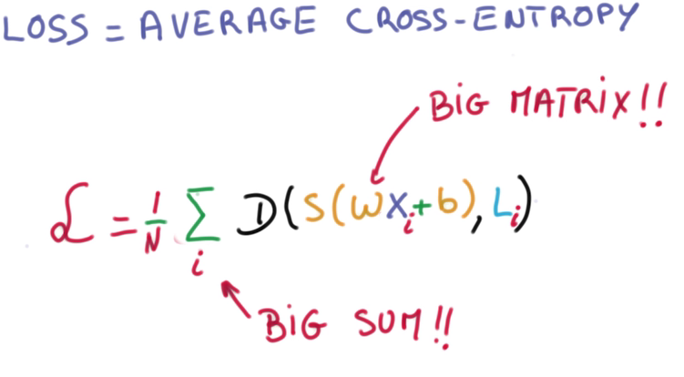
 
 D的平均值即是Training loss，求和和矩阵相乘是个大数据的活。
 
 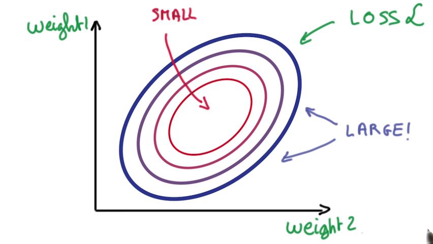
 
 两个参数的误差导致一个呈圆形的loss，所以我们要做的就是找到尽量靠近圆心的weight
 > 机器学习问题变成了一个数值优化
   - 解决方法之一：Gradient descent，求导
   
   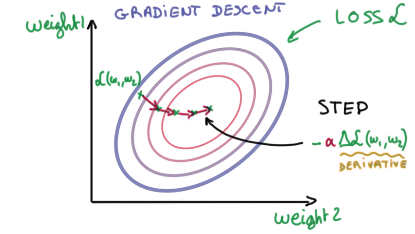
   
   > 修改参数，检查误差是否变大，往变小的方向修改，直到抵达bottom。
   
   > 图中weight是二维的，但事实上可能有极多的weight

### Numerical Stability

> 量级相差太多的数运算会导致许多错误

Example:[num_stable.py](../../src/num_stable.py)

- 你可能以为输出是1， 但结果是一个接近0.95的数。
- 但将1billion换成1，结果就很接近1。
- 因此需要让前面提到的Train loss函数中的数据不要too big or too small

### Normalized Inputs and Initial Wights 
> 归一化输入和初始参数

- 理想目标
  - 均值为0
  - 方差处处相等
 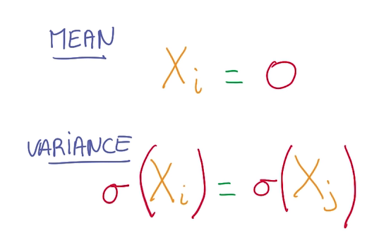
- Math Reason

> Easier for the optimizer to find a good solution
 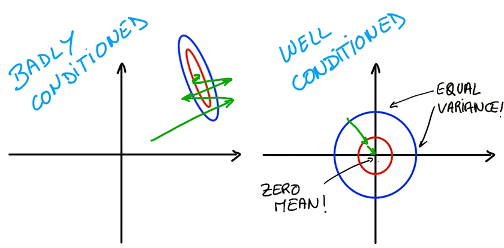

- Example: Images Normalization
```python
R = (R - 128) / 128
G = (G - 128) / 128
B = (B - 128) / 128
```
- Weight Initialization
找到好的weight和bias for the gradient descent to proceed

> A simple, general method

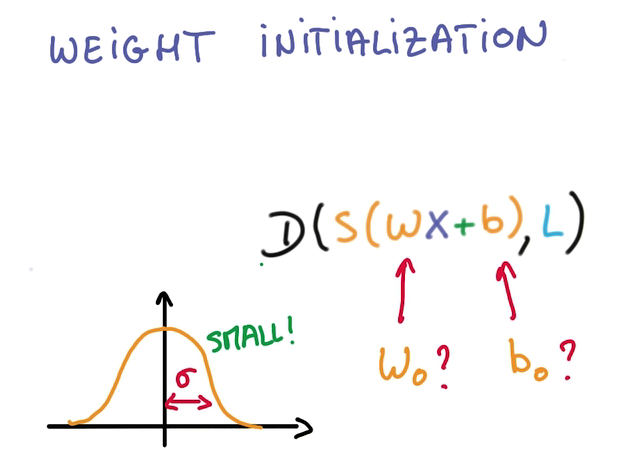
- 用均值为0，标准偏差的高斯分布产生随机的数据填充W矩阵
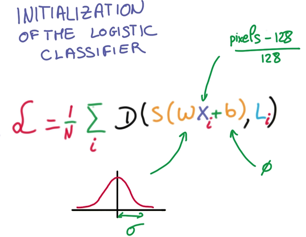
- 高斯分布模型也决定了初始输出(softmax输出)的概率分布
- 高斯分布的sigma越小，说明预测越不确定，sigma的取值很主观
- 我们的工作即是，选一个较小的sigma，让sigma变小到合适的值，使得预测更确定。

- 优化
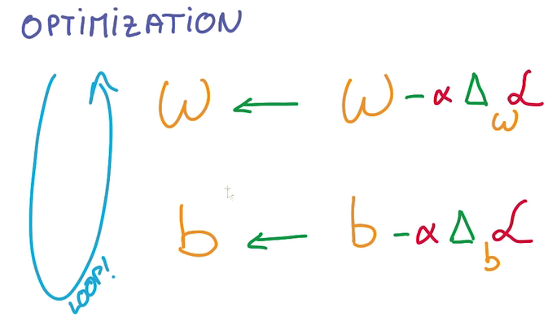
调整W和b，使得Train loss最小

扩展阅读：[西瓜书第三章·线性模型](http://cweihang.cn/ml/melon/ch03.html)
[下一节](practical.md)实践

> 觉得得我的文章对您有帮助的话，就给个[star](https://github.com/ahangchen/GDLnotes)吧～
