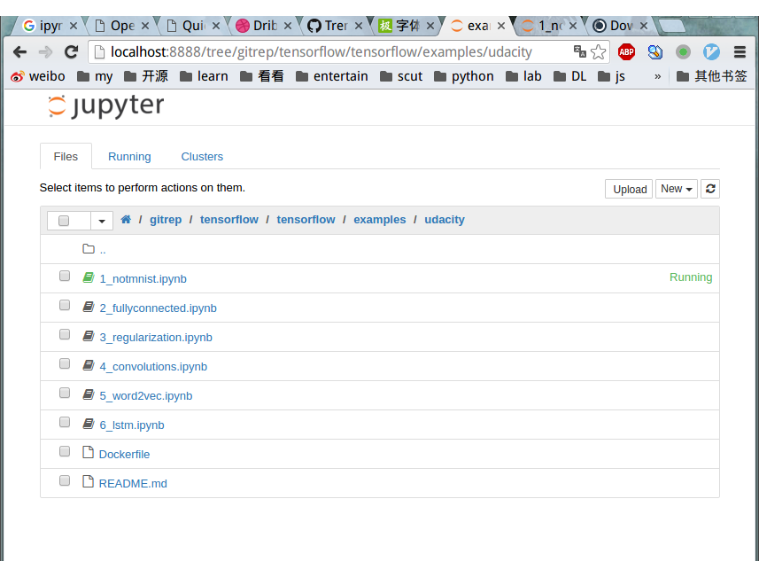
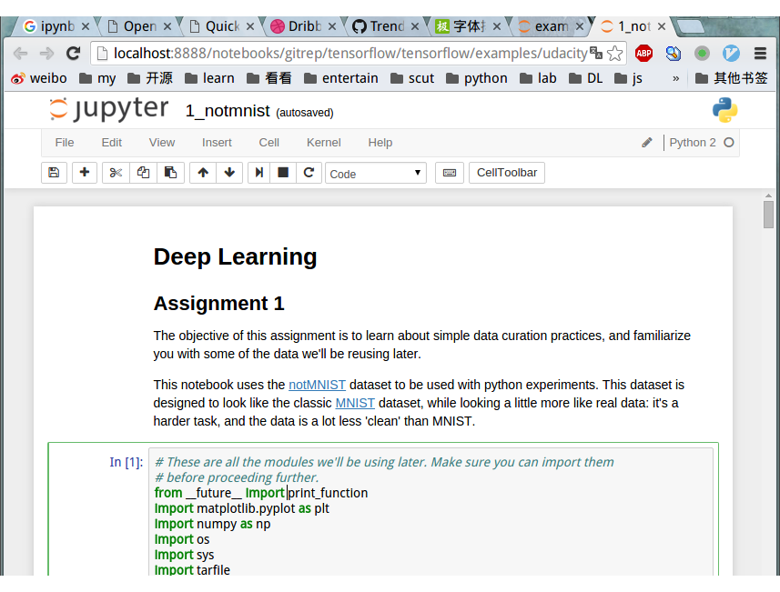

# Practical Aspects of Learning

> Github工程地址：https://github.com/ahangchen/GDLnotes

> 欢迎star，有问题可以到[Issue区](https://github.com/ahangchen/GDLnotes/issues)讨论

> 官方教程[地址](https://classroom.udacity.com/courses/ud730/lessons/6370362152/concepts/63798118170923)

> [视频](http://d2uz2655q5g6b2.cloudfront.net/6370362152/L1%20Machine%20Learning%20to%20Deep%20Learning%20Videos.zip)/[字幕](http://d2uz2655q5g6b2.cloudfront.net/6370362152/L1%20Machine%20Learning%20to%20Deep%20Learning%20Subtitles.zip)下载
   

> 课程目标：学习简单的数据展示，熟悉以后要使用的数据

## Install Ipython NoteBook

可以参考这个[教程](http://opentechschool.github.io/python-data-intro/core/notebook.html)

- 可以直接安装[anaconda](https://www.continuum.io/downloads)，里面包含了各种库，也包含了ipython；
- 推荐使用python2的版本，因为很多lib只支持python2，而且python3在升级中，支持3.4还是3.5是个很纠结的问题。
- 安装anaconda后直接在终端输入 ipython notebook，则会运行一个ipython的server端，同时在你的浏览器中打开基于你终端目录的一个页面：

- 点开ipynb文件即可进入文件编辑页面

上图即为practical部分的教程，可以在github[下载](https://github.com/tensorflow/tensorflow/tree/master/tensorflow/examples/udacity)

官方推荐使用docker来进行这部分教程，但简单起见我们先用ipython notebook

## [安装tensorflow](https://github.com/ahangchen/GDLnotes/tree/master/note/tensorflow)

## notMNIST

修改的[MNIST](http://yann.lecun.com/exdb/mnist/)，不够干净，更接近真实数据，比MNIST任务更困难。

## Todo
我将官方教程的一个文件拆成了多个（以文件持久化为边界），然后在[schedule.py](../../src/not_mnist/schedule.py)里统一调用，在各个文件里可以执行各个部分的功能测试。

- 下载
  - 使用urlretrieve来获取数据集notMNIST_large.tar.gz和notMNIST_small.tar.gz

  > 代码示例：[load_data.py](../../src/not_mnist/load_data.py)

- 解压
  - 使用tarfile模块来解压刚刚下载的压缩包

  > 代码示例：[extract.py](../../src/not_mnist/extract.py)

- 读图 - 展示 - 序列化
  - 用ndimage读取一部分图片，用pickle将读取到的对象（ndarray对象的list）序列化存储到磁盘
  - 用matplotlib.plot.imshow实现图片显示，可以展示任意的numpy.ndarray，详见show_imgs(dataset)
  - 这里展示的是二值化图片，可以设置显示为灰度图
  - 将每个class对应的图像数据集序列化到磁盘

  > 代码示例：[img_pickle.py](../../src/not_mnist/img_pickle.py)

- 整理数据集
  - 用pickle读取pickle文件，
  - 从train_folder中为10个class分别获取10000个valid_dataset和20000个train_dataset，
  - 其中对每个class读取到的数据，用random.shuffle将数据乱序化
  - 将各个class及其对应的label序列化到磁盘，分别为训练器和校验集
  - 从test_folder中为10个class分别获取10000个test_dataset,
  - 其中对每个class读取到的数据，用random.shuffle将数据乱序化
  - 将各个class及其对应的label序列化到磁盘，作为测试集

  > 代码示例[merge_prune.py](../../src/not_mnist/merge_prune.py)

- 去除重复数据 
    - load_pickle，加载dataset
    - 先将valid_dataset中与test_dataset重复部分剔除，再将train_dataset中与valid_dataset重复部分剔除
    - 每个dataset都是一个二维浮点数组的list，也可以理解为三维浮点数组，
    - 比较list中的每个图，也就是将list1中每个二维浮点数组与list2中每个二维浮点数组比较
    - 示例代码即为[clean_overlap.py](../../src/not_mnist/clean_overlap.py)中的imgs_idx_except
    
    - 我们在拿list1中的一个元素跟list2中的一个元素比较时，总共需要比较len(list1) * len(list2) * image_size * image_size次，速度极慢
    - 实际上这是有重复的计算的，就在于，list2中的每个元素，都被遍历了len(list1)次
    - 因此有这样的一个优化，我们遍历每个图，用图中的灰度值，仿照BKDRHash，得到每个图都不同的hash值，比较hash值来比较图像
    - 示例代码即为[clean_overlap.py](../../src/not_mnist/clean_overlap.py)中的imgs_idx_hash_except
    
    - 这样每个图都只需要访问一次，计算hash的时间变为(len(list1) + len(list2)) * image_size * image_size
    - 比较的次数是len(list1) * len(list2)
    - 由于我们的数据中，list1和list2的长度是大数，所以节省的时间是相当可观的
    - 在我的机器上，比较完valid_dataset和test_dataset需要的时间分别是25000秒（10000次比较，每次2-3秒）和60秒
    
    - 然后再将清理后的数据序列化到磁盘即可

  > 代码示例： [clean_overlap.py](../../src/not_mnist/clean_overlap.py)

- 训练一个logistics 模型
  - 将train_dataset作为输入，用valid_dataset进行验证（预测成功率81.9%）
  - 为了重复利用训练后的分类器，将其序列化到磁盘
  
  > 代码示例： [logistic_train.py](../../src/not_mnist/logistic_train.py)
 
- Measure Performance
  - 分类器会尝试去记住训练集
  - 遇到训练集中没有的数据时，分类器可能就没辙了
  - 所以我们应该measure的是，分类器如何产生新数据（生成能力（推导能力）越大，说明它应对新数据能力越强）
  - 仅measure分类器记忆数据集的能力并不能应对新数据（没有学到规律），所以不应该拿旧数据去measure
  - 因此measure的方式应该是拿新数据去看分类器的预测准确度（never see, can't memorize）
  
  - 但是在measure的过程中，我们会根据测试数据去重新调整分类器，使其对所有测试数据都生效
  - 也就是说测试数据变成了训练集的一部分，因此这部分数据我们只能作为valid_dataset，而不能用于衡量最后的performance
  
  - 解决方法之一即，最终进行performance measure的数据集，必须是调整分类器的过程中没有使用过的
  
  - 即坚持一个原则，测试数据不用于训练
  
  > 在机器学习比赛Kaggle中，有public data，validate data，并有用于测试（选手未知）的private data，只有在训练时自己的分类器时，预先取一部分数据作为test data，
  才能不会在train和valid的过程中被已有数据所蒙蔽
  
- Validation dataset
  - 验证集越大，验证的可信度越大
  - 统计学上，调整分类器后，当30个以上预测结果的正确性发生变化的话，这种变化是可信的，值得注意的，小于30是噪音
  - 因此Validation dataset通常数据要大于30000个，在准确率变化高于0.1%时，认为分类器的performance变化
  - 但这样需要的数据往往偏多，所以可以尝试交叉验证（cross validation），交叉验证有个缺点是速度慢
  - 验证时，使用tensor.eval(input)，相当于tf.get_default_session().run(tensor)

扩展阅读：西瓜书第二章·[模型评估与选择](http://cweihang.cn/ml/melon/ch02.html)

> 觉得得我的文章对您有帮助的话，就给个[star](https://github.com/ahangchen/GDLnotes)吧～
