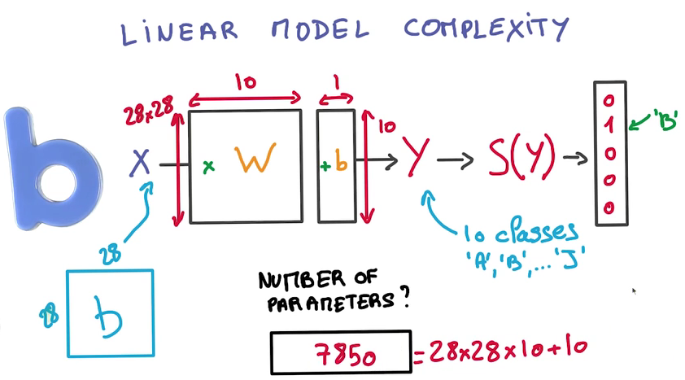
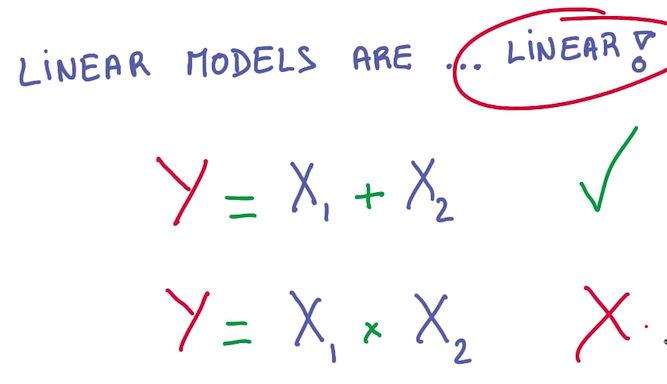
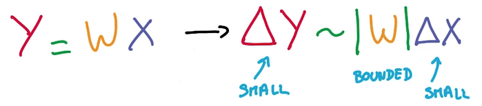
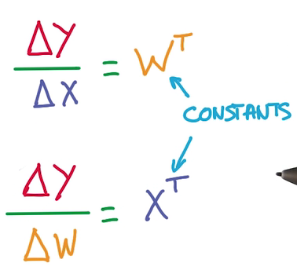
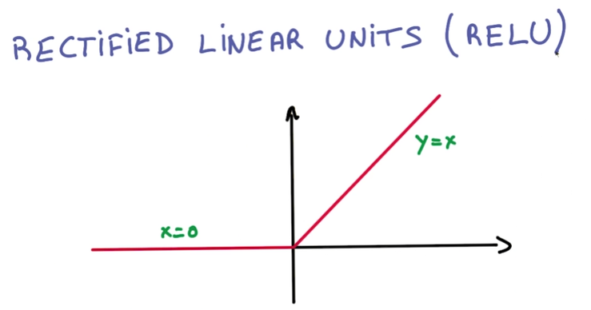

# Limit of Linear Model
- 实际要调整的参数很多

> 如果有N个Class，K个Label，需要调整的参数就有(N+1)K个
 
- Linear Model不能应对非线性的问题

- Linear Model的好处
  - GPU就是设计用于大矩阵相乘的，因此它们用来计算Linear Model非常高效
  - Stable：input的微小改变不会很大地影响output
  
  - 求导方便：线性求导是常数
  
- 我们想要参数函数是线性的，但整个model是非线性的
- 所以需要对各个线性模型做非线性组合
  - 最简单的非线性组合：分段线性函数（RELU）
  