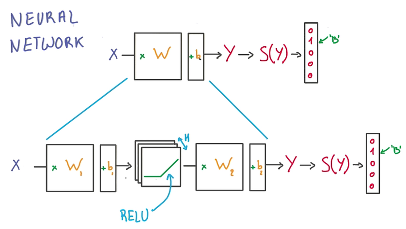
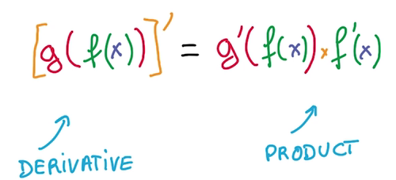
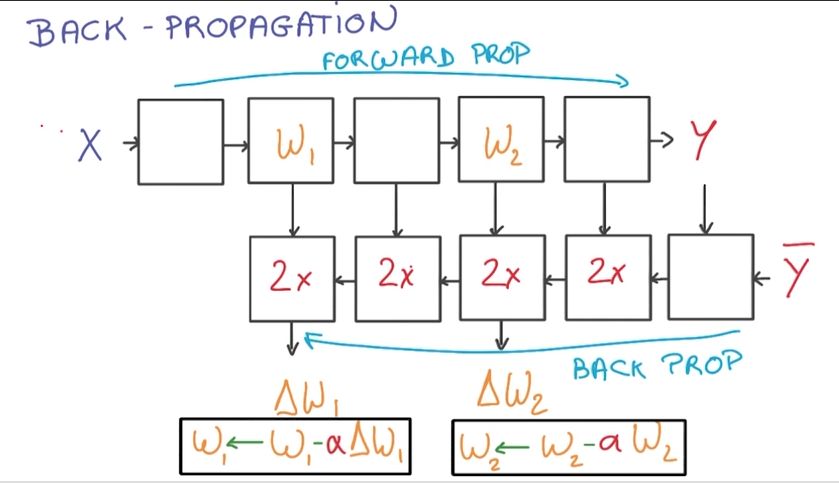

# Neural network
- 用一个RELU作为中介，一个Linear Model的输出作为其输入，其输出作为另一个Linear Model的输入，使其能够解决非线性问题

- 神经网络并不一定要完全像神经元那样工作
- Chain Rule：复合函数求导规律

- 大量可重用的数据，易于实现（简单的数据流）
- Back propagation

  
 
  - 计算train_loss时，数据正向流入，计算梯度时，逆向计算
  - 计算梯度需要的内存和计算时间是计算train_loss的两倍
  
- 利用上面的知识，结合lesson1中的SGD，训练一个全连接神经网络：[神经网络实践](neural_practical.md)

> 扩展阅读：[西瓜书第五章·神经网络](http://cweihang.cn/ml/melon/ch05.html)
