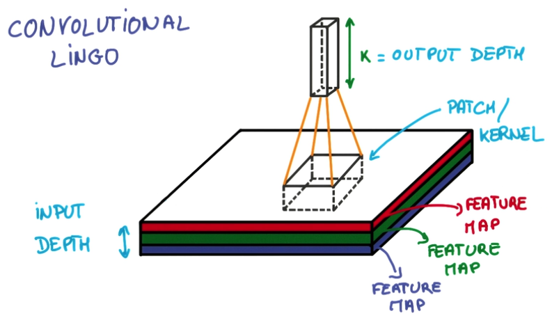
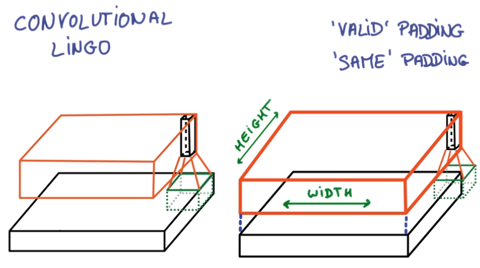
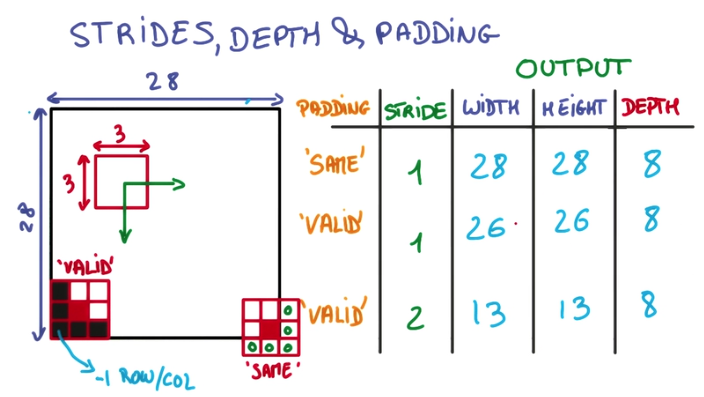
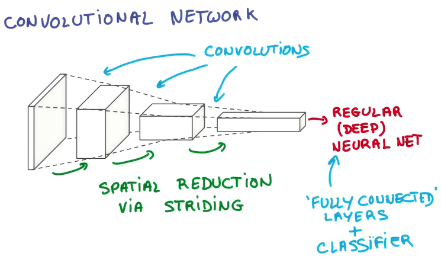
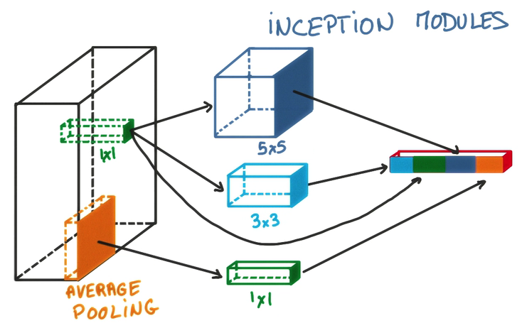

# Convolutional Networks

> deep dive into images and convolutional models

## Convnet

### BackGround 
- 人眼在识别图像时，往往从局部到全局
- 局部与局部之间联系往往不太紧密
- 我们不需要神经网络中的每个结点都掌握全局的知识，因此可以从这里减少需要学习的参数数量

### Weight share
- 但这样参数其实还是挺多的，所以有了另一种方法：权值共享

> Share Parameters across space

- 取图片的一小块，在上面做神经网络分析，会得到一些预测
- 将切片做好的神经网络作用于图片的每个区域，得到一系列输出

- 可以增加切片个数提取更多特征
- 在这个过程中，梯度的计算跟之前是一样的

### Concept

- Patch/Kernel：一个局部切片
- Depth: 数据的深度，图像数据是三维的，长宽和RGB，神经网络的预测输出也属于一维
- Feature Map：每层Conv网络，因为它们将前一层的feature映射到后一层（Output map）

- Stride: 移动切片的步长，影响取样的数量
- 在边缘上的取样影响Conv层的面积，由于移动步长不一定能整除整张图的像素宽度，不越过边缘取样会得到Valid Padding， 越过边缘取样会得到Same Padding
- Example 
  
  
  - 用一个3x3的网格在一个28x28的图像上做切片并移动
  - 移动到边缘上的时候，如果不超出边缘，3x3的中心就到不了边界
  - 因此得到的内容就会缺乏边界的一圈像素点，只能得到26x26的结果
  - 而可以越过边界的情况下，就可以让3x3的中心到达边界的像素点
  - 超出部分的矩阵补零就行

## Deep Convnet
在Convnet上套Convnet，就可以一层一层综合局部得到的信息

## OutPut
将一个deep and narrow的feature层作为输入，传给一个Regular神经网络

## Optimization
### Pooling
将不同Stride的卷积用某种方式合并起来，节省卷积层的空间复杂度。

- Max Pooling
在一个卷积层的输出层上取一个切片，取其中最大值代表这个切片
- 优点
  - 不增加需要调整的参数
  - 通常比其他方法准确
- 缺点：更多Hyper Parameter，包括要取最值的切片大小，以及去切片的步长

> LENET-5, ALEXNET

- Average Pooling
在卷积层输出中，取切片，取平均值代表这个切片

### 1x1 Convolutions
在一个卷积层的输出层上，加一个1x1的卷积层，这样就形成了一个小型的神经网络。
- cheap for deeper model
- 结合Average Pooling食用效果更加
### Inception
对同一个卷积层输出，执行各种二次计算，将各种结果堆叠到新输出的depth方向上

## [卷积神经网络实践](practice.md)

## 参考链接
- 张雨石 [Conv神经网络](http://blog.csdn.net/stdcoutzyx/article/details/41596663)
- Bill Xia [卷积神经网络（CNN）](http://ibillxia.github.io/blog/2013/04/06/Convolutional-Neural-Networks/)