# Deep Models for Text and Sequence

## Rare Event
与其他机器学习不同，在文本分析里，陌生的东西（rare event）往往是最重要的，而最常见的东西往往是最不重要的。

## 语法多义性
- 一个东西可能有多个名字，对这种related文本能够做参数共享是最好的
- 需要识别单词，还要识别其关系，就需要过量label数据

## 无监督学习
- 不用label进行训练，训练文本是非常多的，关键是要找到训练的内容
- 遵循这样一个思想：相似的词汇出现在相似的场景中
- 不需要知道一个词真实的含义，词的含义由它所处的历史环境决定

## Embeddings
- 将单词映射到一个向量（Word2Vec），越相似的单词的向量会越接近
- 新的词可以由语境得到共享参数

## Word2Vec
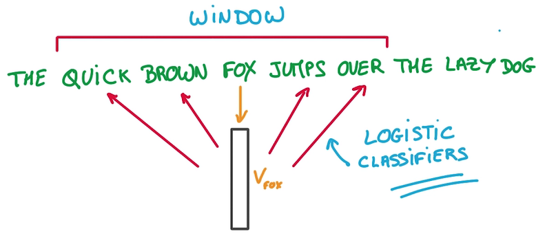

- 将每个词映射到一个Vector列表(就是一个Embeddings)里，一开始随机，用这个Embedding进行预测
- Context即Vector列表里的邻居
- 目标是让Window里相近的词放在相邻的位置，即预测一个词的邻居
- 用来预测这些相邻位置单词的模型只是一个Logistics Regression， just a simple Linear model
### Comparing embeddings
- 比较两个vector之间的夹角大小来判断接近程度，用cos值而非L2计算，因为vector的长度和分类是不相关的：

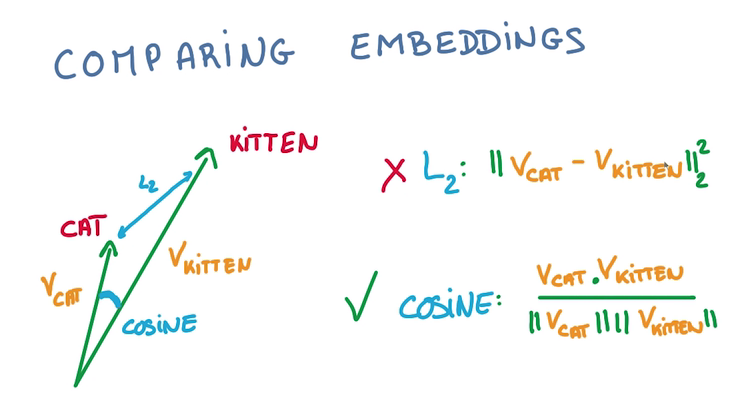

- 最好将要计算的vector都归一化

### Predict Words

- 单词经过embedding变成一个vector
- 然后输入一个WX+b，做一个线性模型
- 输出的label概率为输入文本中的词汇
- 问题在于WX+b输出时，label太多了，计算这种softmax很低效
- 解决方法是，筛掉不可能是目标的label，只计算某个label在某个局部的概率，sample softmax

## t-SNE
- 查看某个词在embedding里的最近邻居可以看到单词间的语义接近关系
- 将vector构成的空间降维，可以更高效地查找最近单词，但降维过程中要保持邻居关系（原来接近的降维后还要接近）
- t-SNE就是这样一种有效的方法

## 类比
- 实际上我们能得到的不仅是单词的邻接关系，由于将单词向量化，可以对单词进行计算
- 可以通过计算进行语义加减，语法加减

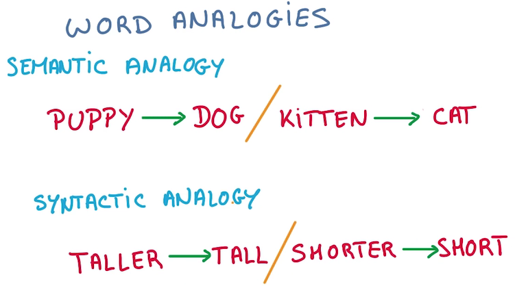

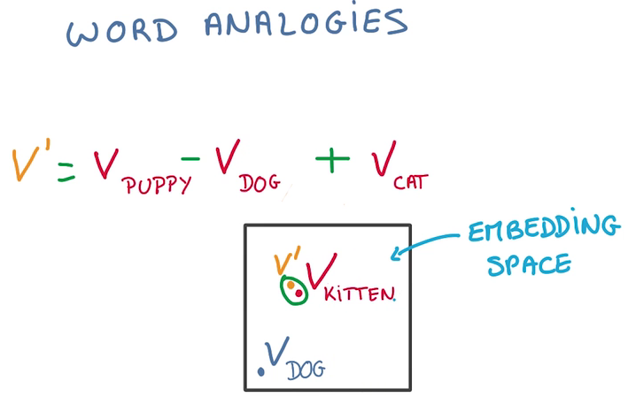

## Sequence
文本（Text）是单词（word）的序列，一个关键特点是长度可变，就不能直接变为vector

### CNN and RNN
CNN 在空间上共享参数，RNN在时间上（顺序上）共享参数
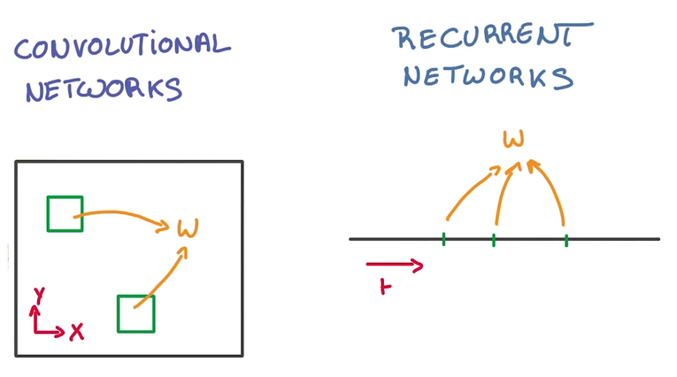

- 在每轮训练中，需要判断至今为之发生了什么，过去输入的所有数据都对当下的分类造成影响
- 一种思路是记忆之前的分类器的状态，在这个基础上训练新的分类器，从而结合历史影响
- 这样需要大量历史分类器
- 重用分类器，只用一个分类器总结状态，其他分类器接受对应时间的训练，然后传递状态

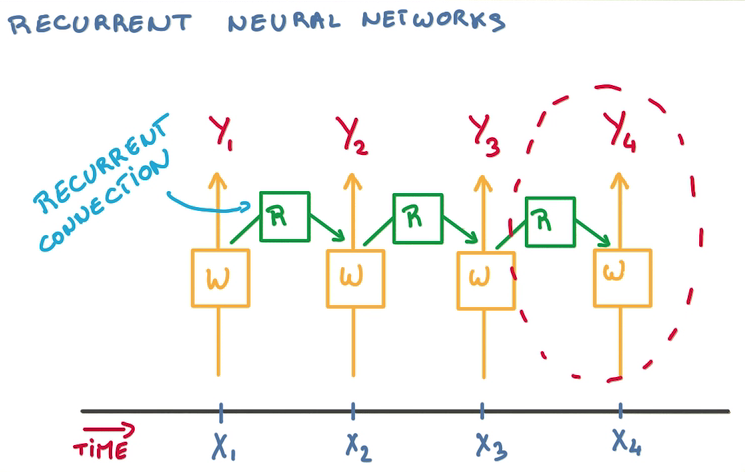

### RNN Derivatives
- BackPropagation Through time 
- 对同一个weight参数，会有许多求导操作同时更新之
- 对SGD不友好，因为SGD是用许多不相关的求导更新参数，以保证训练的稳定性
- 由于梯度之间的相关性，导致梯度爆炸或者梯度消失

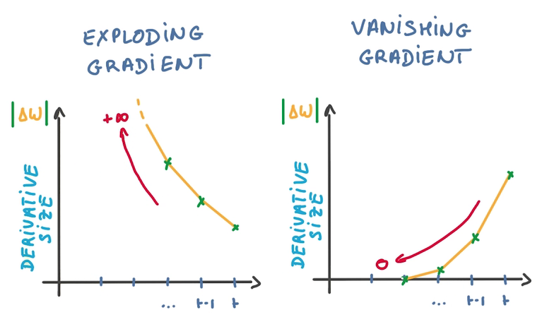

- 使得训练时找不到优化方向，训练失败

#### Clip Gradient
计算到梯度爆炸的时候，使用一个比值来代替△W（梯度是回流计算的，横坐标从右往左看）

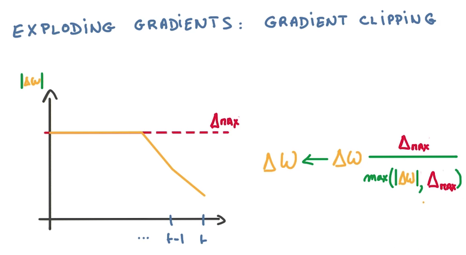

- Hack but cheap and effective

#### LSTM（Long Short-Term Memory）
梯度消失会导致分类器只对最近的消息的变化有反应，淡化以前训练的参数，也不能用比值的方法来解决
- 一个RNN的model包含两个输入，一个是过去状态，一个是新的数据，两个输出，一个是预测，一个是将来状态

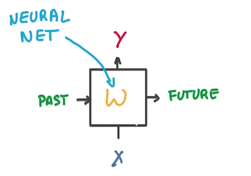

- 中间是一个简单的神经网络
- 将中间的部分换成LSTM-cell就能解决梯度消失问题
- 我们的目的是提高RNN的记忆能力
- Memory Cell

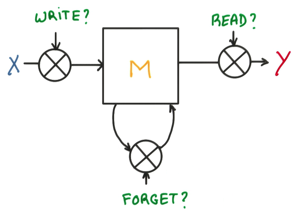

三个门，决定是否写/读/遗忘/写回

  - 在每个门上，不单纯做yes/no的判断，而是使用一个权重，决定对输入的接收程度
  - 这个权重是一个连续的函数，可以求导，也就可以进行训练，这是LSTM的核心
  
 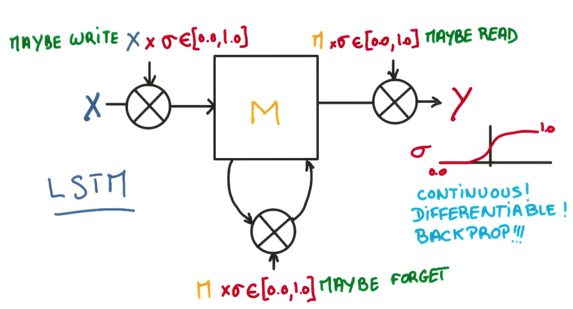
  - 用一个逻辑回归训练这些门，在输出进行归一化
  
  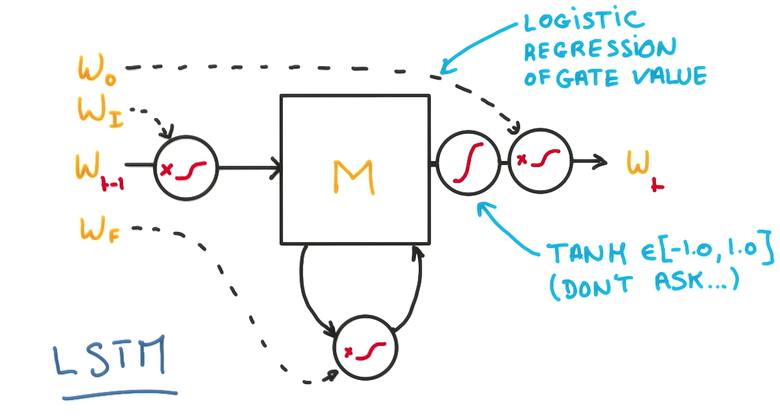
  
  - 这样的模型能让整个cell更好地记忆与遗忘
  - 由于整个模型都是线性的，所以可以方便地求导和训练
  
- 关于lstm有这样一篇博客讲的很好：[地址](http://colah.github.io/posts/2015-08-Understanding-LSTMs/)
- 稍微翻了一个[中文版](unstand_lstm.md)

#### LSTM Regularization
- L2, works
- Dropout on the input or output of data, works

### Beam Search
有了上面的模型之后，我们可以根据上文来推测下文，甚至创造下文，预测，筛选最大概率的词，喂回，继续预测……

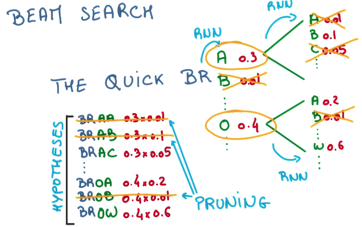

- 我们可以每次只预测一个字母，but this is greedy，每次都挑最好的那个
- 也可以每次多预测几步，然后挑整体概率较高的那个，以减少偶然因素的影响
- 但这样需要生成的sequence会指数增长
- 因此我们在多预测几步的时候，只为概率比较高的几个候选项做预测，that's beam search.

## 翻译与识图
- RNN将variable length sequence问题变成了fixed length vector问题，同时因为实际上我们能利用vector进行预测，我们也可以将vector变成sequence

- 我们可以利用这一点，输入一个序列，到一个RNN里，将输出输入到另一个逆RNN序列，形成另一种序列，比如，语言翻译
- 如果我们将CNN的输出接到一个RNN，就可以做一种识图系统

## [循环神经网络实践](rnn_practice.md)