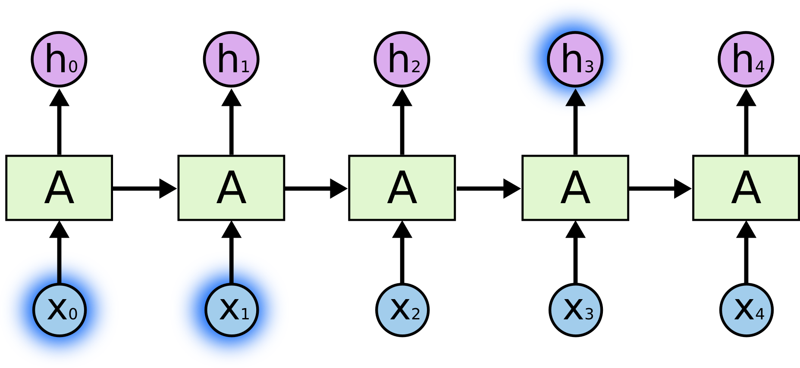
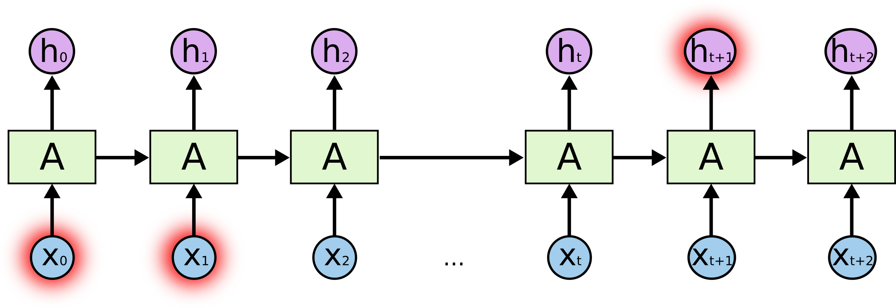
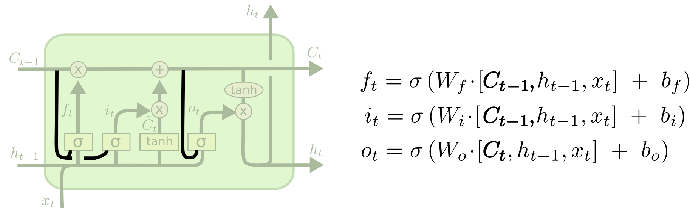
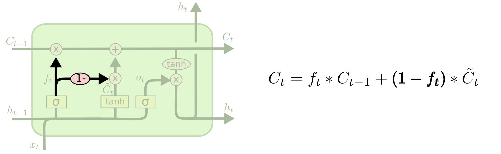

# 理解LSTM 网络
- Posted on August 27, 2015 

## 循环神经网络

人不会每时每刻都从抓取信息这一步开始思考。你在读这篇文章的时候，你对每个次的理解是基于你对以前的词汇的理解的。你不会把所有东西都释放出来然后再从抓取信息开始重新思考，你的思维是有持续性的。

传统的神经网络不能做到这一点， 而且好像这是传统神经网络的一个主要缺点。例如，想象你想要区分一个电影里的每个时刻正在发生的事情。一个传统的神经网络将会如何利用它对过去电影中事件的推理，来预测后续的事件，这个过程是不清晰的。

循环神经网络解决了这个问题。在循环神经网络里，有循环，允许信息持续产生作用。

在上面的图中，一大块神经网络，A，观察一些输入xt，输出一个值ht。循环允许信息从网络的一步传到下一步。

这些循环使得循环神经网络似乎有点神秘。然而，如果你想多一点，其实它们跟一个正常的神经网络没有神秘区别。一个循环神经网络可以被认为是同一个网络的多重副本，每个部分会向继任者传递一个信息。想一想，如果我们展开了循环会发生什么：

这个链式本质揭示了，循环神经网络跟序列和列表是紧密相关的。它们是神经网络为这类数据而生的自然架构。

并且它们真的起了作用！在过去的几年里，应用RNN到许多问题中都取得了难以置信的成功：语音识别，语言建模，翻译，图像截取，等等。我会留一个话题，讨论学习Andrej Karpathy的博客能够取得多么令人惊艳的成绩：

[The Unreasonable Effectiveness of Recurrent Neural Networks](http://karpathy.github.io/2015/05/21/rnn-effectiveness/)。但它们真的相当惊艳。

与这些成功紧密相关的是对LSTM的使用，一个非常特殊的循环神经网络的类型。它在许多任务上都能比标准的RNN工作的好得多。几乎所有基于RNN的神经网络取得的激动人心的成果都由LSTM获得。这篇文章将要探索的就是这些LSTM。

## Long-Term依赖问题

RNN吸引人的一个地方是它们能够链接先前的信息与当前的任务，比如使用先前的视频帧可能预测对于当前帧的理解。如果RNN能够做到这种事情，它们会变得极度有用。但真的可以吗？不好说。

有时候，我们只需要查看最近的信息来执行现在的任务，例如，考虑一个语言模型试图基于先前的词预测下一个词。如果我们要预测“the clouds are in the sky”，我们不需要其他更遥远的上下文 —— 非常明显，下一个词就应该是sky。在这样的例子中，相关信息和目的地之间的距离是很小的。RNN可以学着区使用过去的信息。

但也有一些情况是我们需要更多上下文的。考虑预测这个句子中最后一个词：“I grew up in France... I speak fluent French.” 最近的信息表明下一个词可能是一种语言的名字，但如果我们想要找出是哪种语言，我们需要从更久远的地方获取France的上下文。相关信息和目标之间的距离完全可能是非常巨大的。

不幸的是，随着距离的增大，RNN变得不能够连接信息。

长期依赖导致的神经网络困境

理论上，RNN是绝对能够处理这样的“长期依赖的”。人类可以仔细地从这些词中找到参数然后解决这种形式的一些雏形问题。然而，实践中，RNN似乎不能够学习到这些。 Hochreiter (1991) [German] 和 Bengio, et al. 1994年曾探索过这个问题，他们发现了一些非常根本的导致RNN难以生效的原因。

万幸的是，LSTM没有这个问题！

## LSTM 网络

长短期记忆网络 - 通常简称为“LSTMs”，是一种特殊的RNN，适用于学习长期依赖。
他们由[Hochreiter 和 Schmidhuber（1997）](http://deeplearning.cs.cmu.edu/pdfs/Hochreiter97_lstm.pdf)介绍引入，
由许多其他的人们在后续的工作中重新定义和丰富。
他们在各种各样的问题中都工作的特别好，并且现在已经被广泛使用。

LSTMs 是为了避免长期依赖问题而特殊设计的。为长期时间记忆信息实际上是他们默认的行为，
而非他们需要学习的东西！

所有RNN都有重复神经网络模型的链式形式。在标准的RNN中，这种重复模型会有一种非常简单的结构，比如简单的tanh层。

The repeating module in a standard RNN contains a single layer.

LSTM也有这种链式结构，但重复单元有着一种不同的结构。里面不再是只有单一的神经网络层，里面有四个，以非常简单的方式起作用。

The repeating module in an LSTM contains four interacting layers.

不要担心内部的细节。我们稍后会一步一步遍历LSTM图。现在，我们要熟悉我们将要使用的定义：

在上面的图中，每行都有一个箭头，从一个结点的输出到另外的结点的输入。粉色的圆代表结点操作，比如向量相加，而黄色的长方形是学习的神经网络层。
线的合并代表denote的链接，而箭头的分叉代表内容复制后流向不同的位置。

## LSTM背后的核心思想

LSTM的关键在于cell的状态，也就是图中贯穿顶部的那条水平线。

cell的状态像是一条传送带，它贯穿整条链，其中只发生一些小的线性作用。信息流过这条线而不改变是非常容易的。

LSTM确实有能力移除或增加信息到cell状态中，由被称为门的结构精细控制。

门是一种让信息可选地通过的方法。它们由一个sigmoid神经网络层和一个点乘操作组成。

sigmod层输出[0, 1]区间内的数，描述了每个部分中应该通过的比例。输出0意味着“什么都不能通过”，而输出1意味着“让所有东西通过！”。

一个LSTM有四个这样的门，以保护和控制cell的状态。

## 深入浅出LSTM

我们的LSTM的第一步是决定我们需要从cell状态中扔掉什么样的信息。这个决策由一个称为“遗忘门”的sigmoid层做出。它观察ht-1和xt，位cell状态Ct-1中每个number输出一个0和1之间的数。1代表“完全保留这个值”，而0代表“完全扔掉这个值”。

让我们回到我们那个基于上文预测最后一个词的语言模型。在这样一个问题中，cell的状态可能包含当前主题的种类，这样才能使用正确的名词。当我们看到一个新的主题的时候，我们会想要遗忘旧的主题的种类。

下一步是决定我们需要在cell state里存储什么样的信息。这个问题有两个部分。第一，一个sigmoid层调用“输入门”以决定哪些数据是需要更新的。然后，一个tanh层为新的候选值创建一个向量C~t，这些值能够加入state中。下一步，我们要将这两个部分合并以创建对state的更新。

在我们的语言模型的例子中，我们想要把主题的种类加入到cell state中，以替代我们要遗忘的旧的种类。

现在是时候更新旧的cell stateCt-1到新的cell stateCt。前一步已经决定了我们需要做的事情，我们只需要实现它。

我们把旧的state与ft相乘，遗忘我们先前决定遗忘的东西，然后我们加上it \* C~t。这是新的候选值，受我们对每个状态值的更新度约束而缩放。

在语言模型的例子中，这就是我们真正扔掉旧主题种类，并增加新的信息的地方，正如我们之前所决定的。

最后，我们需要决定要输出的东西。这个输出基于我们的cell state，但会是一个过滤版本。首先，我们运行一个sigmoid层，以决定cell state中的那个部分是我们将要输出的。然后我们把cell state放进tanh（将数值压到-1和1之间），最后将它与sigmoid门的输出相乘，这样我们就只输出了我们想要的部分了。

语言模型的例子中，由于它仅关注一个主题，它可能会输出与一个动词相关的信息，以防后面还有其他的词。比如，它可能输出这个主题是单数还是复数，让我们知道如果后面还有东西，动词才会对应出现。

## LSTM变种

到目前为止我所描述的是一种非常普通的LSTM，但不是所有的LSTM都和上面描述的这种一样。事实上，几乎所有涉及LSTM的文章用的版本都稍有不同，差别微小，但值得一谈。

一种由[Gers & Schmidhuber (2000)](ftp://ftp.idsia.ch/pub/juergen/TimeCount-IJCNN2000.pdf)介绍的广受欢迎的LSTM变种，添加了“门镜连接”。这意味着我们可以让门观察cell状态。

上面的图为每个门都添加了门镜，但许多文章只会给一部分门镜。

另一种变种是使用多个遗忘门和输入门。我们不再分别判断该遗忘和添加的东西，我们同时做出决策。我们只在填充某个位置的时候遗忘原来的东西，我们值在遗忘某些东西的时候输入新的数据。

一个稍微更奇特的变种是循环门单元（Gated Recurrent Unit，GRU），由 [Cho, et al. (2014)](http://arxiv.org/pdf/1406.1078v3.pdf)提出。它组合了遗忘门和输入门到一个单独的“更新门”中。它也合并了cell state和hidden state，并且做了一些其他的改变。结果模型比标准LSTM模型更简单，并且正越来越受欢迎。

A gated recurrent unit neural network.

这些只是一些最值得一提的LSTM变种。还有许多其他种类，像[Yao, et al. (2015)](http://arxiv.org/pdf/1508.03790v2.pdf)提出的Depth Gate RNN。也有许多复杂的不同方法来处理长期依赖，像 [Koutnik, et al. (2014)](http://arxiv.org/pdf/1402.3511v1.pdf)提出的Clockwork RNN。
 
哪种变种是最好的？这些区别重要吗？ [Greff, et al. (2015)](http://arxiv.org/pdf/1503.04069.pdf)对流行的变种做了一个很好的比较，发现它们都是一样的。[Jozefowicz, et al. (2015)](http://jmlr.org/proceedings/papers/v37/jozefowicz15.pdf)测试了超过一万中RNN结构，发现某些任务情形下，有些比LSTM工作得更好。

## 结论

首先，我讲述了人们用RNN获得的巨大成果。而这些成果都用到了LSTM，它们在大多数任务中都工作得好得多！

列出方程的话，LSTM看起来很吓人。幸好，在这篇文章里一步步看下来让它们变得相对可以接受了些。

LSTM是我们在RNN上取得的一大步。我们自然会想：还有另一个突破口吗？研究人员中的一个通常的观点是“有！是注意力！”思路是让一个RNN收集信息的每一步都关注更大的一个信息。例如，如果你用一个RNN抽取图片信息来描述它，RNN可能可以为每个输出的词都从图片拿一部分进行分析。事实上，[Xu, et al. (2015)](http://arxiv.org/pdf/1502.03044v2.pdf)就是这样做的 - 这可能是一个有趣的出发点，如果你想要探索注意力这个话题的话。已经有许多令人惊艳的成果了，并且似乎还有更多不为人知的研究。

注意力不是RNN研究中唯一刺激的线。例如，网格LSTM（[Kalchbrenner, et al. (2015)](http://arxiv.org/pdf/1507.01526v1.pdf)）,生产模型中使用RNN（ [Gregor, et al. (2015)](http://arxiv.org/pdf/1502.04623.pdf), [Chung, et al. (2015)](http://arxiv.org/pdf/1506.02216v3.pdf), or [Bayer & Osendorfer (2015)](http://arxiv.org/pdf/1411.7610v3.pdf)），都很有趣。最近几年是RNN的黄金时代，下一年更是如此。

## 致谢
略